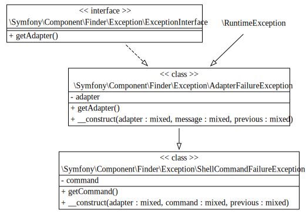
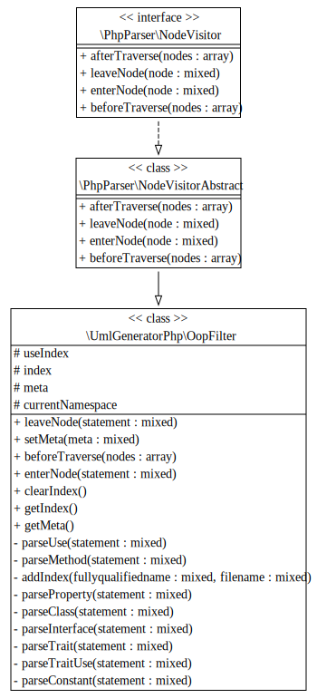

### Generate UML diagrams for your PHP code.

This tool wil generate UML diagrams with all class, interface and trait definitions in your PHP project without
depending on autoloaders.
Instead it uses the PHP Abstract Language Tree from [php-parser][php-parser] to build the class graph.

The project is divided in 2 tools. One parses all your PHP code and generates a new directory structure
containing JSON files. The other parses the JSON structure and generates .dot files for [Graphviz][graphviz].
Then you can use the Graphviz toolkit to render the diagrams to your image format of choice.

If you happen to choose the SVG output format and defined a documentation module for `generate:dot`
the class and method names will be clickable and lead to the defined URLs. The repo currently contains a
documentation module for api.drupal.org.


### Our diagrams

We generate two types for now

* [UML](diagrams/index.html) using GraphViz as a render engine.
* [An animation](diagrams/graph.html) based on information from the indexed files.

### Example output.

This is some example output generated from the Drupal 8 master branch. Some rendering issues may occur
because of broken SVG renderers in browsers. All methods and properties are clickable and link to the Drupal 8 api
documentation website.

<div class="svgexample">
    <a href="images/output/ShellException.svg"></a><br>
    ShellException from Symfony Finder
</div>
<div class="svgexample">
    <a href="images/output/OopFilter.svg"></a><br>
    OopFilter from uml-generator-php
</div>

<iframe src="diagrams/graph.html" width="100%" height="600px"></iframe>
<br style="clear: both;">

### Installation instructions.

Clone the git repository

```bash
$ git clone git@github.com:clemens-tolboom/uml-generator-php.git
```

Install composer dependencies

```bash
$ cd uml-generator-php
$ composer install
```

And install graphviz with your package manager of choise or from git.<br>
uml-generator-php requires graphviz versions later than 15 September 2013 (See [issue #16][issue16])

[php-parser]: https://github.com/nikic/php-parser
[graphviz]: http://graphviz.org/
[issue16]: https://github.com/clemens-tolboom/uml-generator-php/issues/16

### Usage example.

#### Parse PHP into json

To parse your source tree for Classes, Interfaces and Traits run

```
$ bin/uml-generator-php generate:json /Users/clemens/Sites/drupal/d8/www tests/output
```

To exclude directories or files you can use the `--skip` parameter (use it multiple times to exclude more directories or files)
The path provided to `--skip` should be a path relative to the input directory.

To generate only the json files for a subdirectory set the `input` to your project root like normal and use the `--only` flag
to set a directory relative to the input to scan. The `--only` flag can be used multiple times to generate json for more directories
or files.

#### Generate DOT files

Next generate their dot files by running

```
$ bin/uml-generator-php generate:dot -p --documenter drupal tests/output
```

The `--documenter` parameter set the `Documentation` subclass used to generate the urls for all clickable elements in the SVG output.
currently only the `DrupalDocumentation` class is provided. This class generates urls for all fields, classes and methods to the drupal
api website. Read the [create your own documenter][documenter] page to learn how to add your own documenter.

The `-p` (or `--parents`) flag enables including the parent classess and interfaces into the generated SVG output.

You may notice the 'Not found: '. For more info see [#50][issue50]

[issue50]: https://github.com/clemens-tolboom/uml-generator-php/issues/50
[documenter]: documenter.html

#### Generate SVG files

```bash
find tests/output -type f -name "*.dot" -exec dot -Tsvg -O {} \;
```

This command runs the `dot` command from the `graphviz` package for every generated .dot file in the `tests/output` directory.

#### Run from config file

Uml-generator-php supports running from a config file in your project root. Create the file `.uml-generator-php.yml` in your project
root with the contents:

```yaml
# Required
outputdir: tests/output  # The output directory relative to the project root

# Optional
parents:
    enabled: true  # Include parents classes, interfaces and traits in svg output (default false)
    depth: 10  # Add max 10 parents of depth per SVG file (default PHP_MAX_INT)

skip:
    - tests  # Skip the tests directory in your project root

only:
    - src/commands  # Only parse the files in src/commands

legacy: true  # Enable legacy output for graphiz 2.28 (default false)
```

After creating the config file run uml-generator-php anywhere in your project:

```bash
$ uml-generator-php run
```
